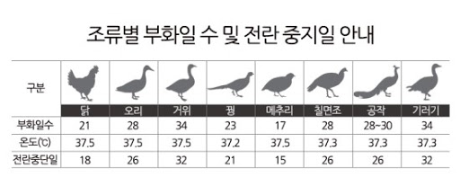

# 도란도란 알부화기

팀원: 이윤지, 박민지   

## 제작 목적
초등 이하의 아이들이 직접 알을 부화시키는 과정을 겪음으로써 정서적으로도 발달하게 돕고, 아두이노를 이용함으로써 교육적으로도 가치를 얻을 수 있게 한다.   

## 작동원리

- 일정한 온도, 습도를 온습도 센서를 이용해 감지하고 LCD 화면에 띄운다.
- 일정 온도에 도달할 때까지 전구를 켜서 온도를 올리고, 일정 온도 이상으로 온도가 올라가게 되면 전구를 자동으로 끈다.
- (전란(알을 굴려 방향을 바꿔줌)을 하루 2-3회 실행한다.
- 습도 조절은 일반 물그릇으로 할 생각
- 기능을 어디까지 넣을지...
    - 전란기능, 온도및 습도 감지, 온도조절, 일별로 전란주기 재설정, 팬 삽입?

## 병아리 부화 시 필요한 조건

- 부화일수: 21일
- 온도: 섭씨 37.5도
- 습도: 1-19일: 60%, 20-21일: 80%
- 전란주기: 1일 3회(1~18일까지)
- 전란 중단일: 19일
- 조금의 환기 필요

## [제작과정](./content/process.md)

