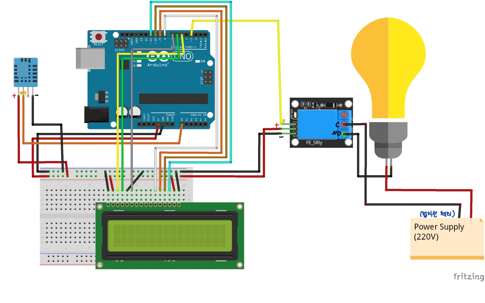

# 도란도란 알부화기


## 제작 목적
초등 이하의 아이들이 직접 알을 부화시키는 과정을 겪음으로써 정서적으로도 발달하게 돕고, 아두이노를 이용함으로써 교육적으로도 가치를 얻을 수 있게 한다.   


## 작동원리

- 일정한 온도, 습도를 온습도 센서를 이용해 감지하고 LCD 화면에 띄운다.
- 일정 온도에 도달할 때까지 전구를 켜서 온도를 올리고, 일정 온도 이상으로 온도가 올라가게 되면 전구를 자동으로 끈다.
- (전란(알을 굴려 방향을 바꿔줌)을 하루 2-3회 실행한다.
- 습도 조절은 일반 물그릇으로 할 생각
- 기능을 어디까지 넣을지...
    - 전란기능, 온도및 습도 감지, 온도조절, 일별로 전란주기 재설정, 팬 삽입?


## 병아리 부화 시 필요한 조건

- 부화일수: 21일
- 온도: 섭씨 37.5도
- 습도: 1~19일: 60%, 20~21일: 80%
- 전란주기: 1일 3회(1~18일까지)
- 전란 중단일: 19일
- 조금의 환기 필요


## 필요한 부품

- 아두이노 우노
- 온습도 센서(DHT11)
- 릴레이 모듈(5V)
- 전구(20W)
- LCD
- 스텝모터? 서보모터?
- 팬
- 220V 전원 케이블
- 9V DC어댑터
- 빵판
- 외부 케이스
- 보온재




위와 같이 회로를 구성해준다. 

※ 릴레이를 설치하기 위해서는 220V 전선의 피복을 벗겨야 하는데, 이 때 전선 안에 2개 또는 3개의 작은 전선이 들어있을 수 있다. 내부전선이 2개인 경우 두 전선을 구분하지 않고 연결해주면 되고, 3개인 경우 하나는 접지선이다. 흔히 초록색 선으로 표시되어 있을 것이다. 이 때는 접지선을 제외한 나머지 전선을 내부전선이 2개인 전선처럼 구분하지 않고 연결해주면 된다.


```
//hatcher_00
//일반lcd 사용

#include <SimpleDHT.h>
#include <LiquidCrystal.h>

#define DHTpin A0
#define DHTTYPE DHT11
#define LCD_resolution 5 //lcd 선명도
#define RELAYpin 3

SimpleDHT11 dht11(DHTpin);
LiquidCrystal lcd(6, 7, 8, 9, 10, 11);

void setup () {
  
  pinMode(RELAYpin, OUTPUT);
  digitalWrite(RELAYpin, LOW);
  
  
  lcd.begin(16,2);
  analogWrite(LCD_resolution, 100);//lcd 글자 선명도 조절
  lcd.clear();
}

void loop () {
  byte t=0;
  byte h=0;

  dht11.read(&t, &h, NULL);//온도, 습도값 읽어서 저장
  
  lcd.setCursor(0,0);
  lcd.print("T:");
  lcd.print(t);
  lcd.print("(C)");
  lcd.setCursor(9,0);
  lcd.print("H:");
  lcd.print(h);
  lcd.print("(%)");

  delay(500);

  //전구제어: 38도가 넘으면 전구 끔, 아닐때는 켬
  if(t>38) digitalWrite(RELAYpin, LOW);
  else digitalWrite(RELAYpin, HIGH);

}
```


   
그냥 종이상자만으로는 31~32도 정도가 거의 마지노선인 듯 하다.


# 생각해 볼 점(11/16 기준)

- 배터리 문제 - 사용하지 않을 때는 배터리를 분리해 둬야 방전되지 않음. 혹은 220v 전원으로 해결할 수 있다면 best!
    - 전원 어댑터를 사용하는 방향으로?
- 온도 부족 - 현재는 약 31도 정도가 마지노선인 듯. 최소 35도 이상은 나와줘야 함
    - 외부 케이스 보강 필요 - 좀 더 보온성이 좋은 소재로 케이스 보강 필요.
- 온도/습도 측정이 정확하게 되는지 확인 필요.
    - 온습도 센서로 측정되는 온도와 습도값이 실제 온도계와 습도계를 이용하여 측정하였을 때와 비슷한지 확인 필요
    - 실제 온도계, 습도계도 필요...
- 팬을 달려면 릴레이를 2채널로 사용해야 할 듯.
- lcd쉴드를 사용하면 더 수월할지? 하지만 너무 과한것 아닌지....마찬가지로 가습기 모듈도 단가가 올라가서 좀 과한듯...
- 전란은 서보모터로 감당 가능할지?
-


